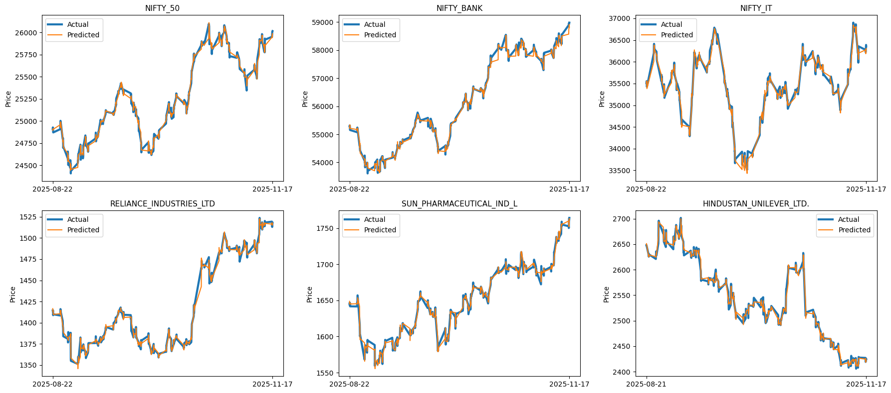
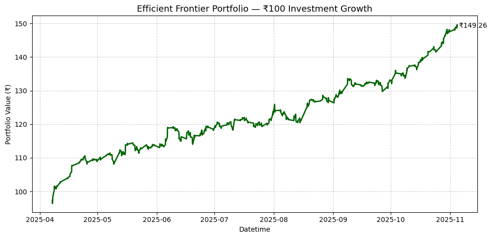
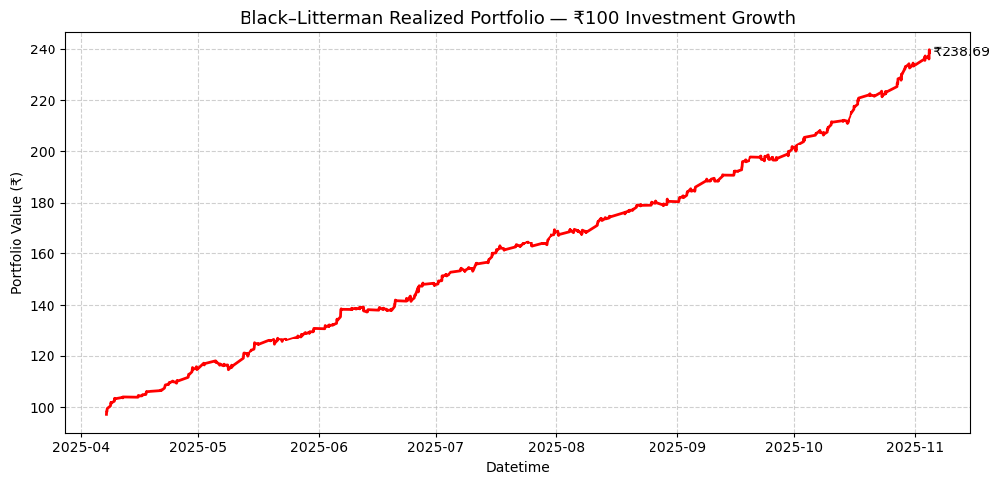
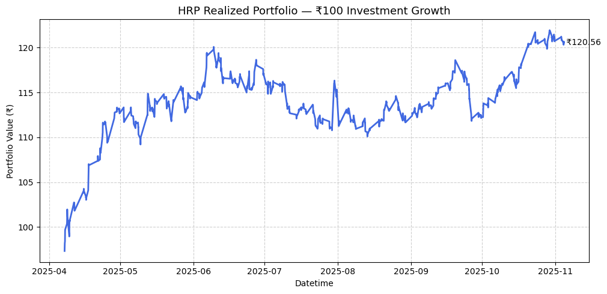

# QuantPulse: Short term Portfolio Optimizer

### 📌 Abstract

**QuantPulse** is an end-to-end framework for **short-term portfolio optimisation** that combines **machine-learning–based price prediction** with **dynamic, rolling portfolio construction**.
Traditional portfolio optimisation methods rely on long-term historical averages for return and risk estimation, which fail to adapt to rapidly changing market conditions. QuantPulse addresses this limitation by **forecasting short-term future prices** and **recomputing risk–return statistics dynamically**, enabling more realistic and responsive portfolio decisions.

Although several optimisation ideas were explored during development, **this repository and the accompanying report/presentation include only three portfolio optimisation techniques**:

* **Efficient Frontier (Mean–Variance Optimisation)**
* **Bayesian Portfolio Optimisation**
* **Hierarchical Equal Risk Contribution (HERC)**

These methods were selected to represent **return-focused**, **balanced**, and **risk-focused** strategies within a unified short-term framework.

### 📌 Problem Statement and Motivation

**The Challenge:**

Short-term portfolio optimisation faces key limitations in traditional approaches:

* **Static return estimates**
  Expected returns are usually computed as long-term historical averages, which do not reflect current market regimes.

* **Static risk assumptions**
  Volatility and correlations change rapidly due to news, liquidity shifts, and macro events.

* **Lack of short-term risk-conditioned targets**
  Classical portfolio theory is designed for long-term investing and does not define how much return to target under short-term risk constraints.

These issues cause conventional models to underperform in intraday and short-horizon trading.

**The QuantPulse Solution:**

QuantPulse introduces a **prediction-driven, rolling optimisation framework** that:

* Uses **model-predicted future prices** instead of historical averages
* Computes **risk and return dynamically** using recent data windows or decay weighting
* Continuously **updates portfolio weights** to reflect real-time market behaviour

### 📌 Introduction

This repository implements a **two-stage short-term portfolio optimisation pipeline** for Indian stocks and indices using **hourly market data**:

1. **Rolling short-term price prediction**
2. **Dynamic portfolio construction using three optimisation techniques**

The system is designed for **intraday and short-horizon trading**, where both return and risk evolve quickly and static assumptions break down.

### 📌 How It Works

The QuantPulse pipeline follows a structured workflow:

#### 1️⃣ Data Collection & Preprocessing

* Hourly stock and index data collected using **Yahoo Finance API**
* Cleaning, alignment, and synchronization across assets
* Construction of lag-based and seasonal features

#### 2️⃣ Rolling Short-Term Price Prediction

* **XGBoost regression model**
* Rolling training window (recent ~2000 observations)
* One-hour-ahead price forecasts
* Predicted prices converted into expected short-term returns

#### 3️⃣ Dynamic Risk and Return Estimation

* Risk and covariance computed using:

  * recent lookback windows, or
  * decay-weighted observations
* Ensures rapid adaptation to regime changes

#### 4️⃣ Portfolio Optimisation (Included Methods Only)

Despite experimenting with multiple ideas, **only the following three optimisation methods are implemented and reported**:

* **Efficient Frontier (Mean–Variance Optimisation)**
  Maximises risk-adjusted return using predicted returns and dynamic covariance

* **Bayesian Portfolio Optimisation**
  Shrinks noisy short-term predictions using Bayesian updating for stability

* **Hierarchical Equal Risk Contribution (HERC)**
  Allocates risk hierarchically using correlation clustering, without relying on expected returns

### 📌 Portfolio Optimisation Methods Included

  
  
  

| Method             | Focus           | Key Strength                             |
| ------------------ | --------------- | ---------------------------------------- |
| Efficient Frontier | Return-oriented | Exploits strong predicted momentum       |
| Bayesian Method    | Balanced        | Stabilises noisy short-term predictions  |
| HERC               | Risk-oriented   | Robust diversification under uncertainty |

> ⚠️ **Note:**
### 📌 Scope Clarification: Included vs. Explored Methods

Although multiple portfolio optimisation ideas were explored during the development phase, **only three machine-learning–based portfolio optimisation methods are included in the final implementation, report, and presentation**:

* **Efficient Frontier (Mean–Variance Optimisation)**
* **Bayesian Portfolio Optimisation**
* **Hierarchical Equal Risk Contribution (HERC)**

The following optimisation techniques were **experimented with or prototyped during development but are *not* included in the final project deliverables**:

* **Classical Risk Parity (Equal Risk Contribution without hierarchy)**
* **Exponentially Weighted Covariance–based Mean–Variance Optimisation**
* **Bayesian Black–Litterman–style formulations**
* **Reinforcement Learning–based portfolio optimisation**
* **Heuristic and rule-based allocation strategies**
* **Other experimental return-targeting formulations for short-term trading**

These methods were excluded to **maintain clarity, reproducibility, and a focused comparison** across three complementary optimisation philosophies:

* return-driven,
* uncertainty-aware, and
* risk-balanced.
  
This ensures that the reported results remain **consistent, interpretable, and aligned with the project’s short-term optimisation objective**.

### 📌 Tools and Technologies Used
* **Programming Language:** Python
* **Data Handling:** Pandas, NumPy
* **Prediction Model:** XGBoost
* **Optimisation:** SciPy, custom solvers
* **Risk Modelling:** Rolling & decay-weighted covariance
* **Visualisation:** Matplotlib
* **Notebooks:** Jupyter Notebook

### 📌 Results Summary
* **Efficient Frontier** achieves the highest returns when predictions are strong
* **Bayesian optimisation** provides smoother performance with lower volatility
* **HERC** delivers the lowest risk and most stable portfolios during uncertain periods
* All three methods **outperform the market baseline** in short-term horizons
* Dynamic risk estimation significantly improves stability compared to static models

### 📌 Limitations
* No transaction costs or slippage included
* Assumes instant trade execution
* No liquidity or market-impact modelling
* Designed for research and educational purposes

### 📌 Future Work
* Incorporating transaction costs and execution delays
* Exploring nonlinear prediction models (LSTM, Transformers)
* Regime detection for adaptive risk targeting
* Live paper-trading and deployment
* Liquidity-aware portfolio construction

## 🤝 Let’s Connect!

😊 I’m always open to meaningful conversations, collaborative projects, and idea exchanges in the fields of **graph theory**, **machine learning**, and **data science**.
If you’re interested in discussing new insights, working together on related topics, or contributing to ongoing discussions — feel free to reach out!
**Let’s learn and build together 🚀**
